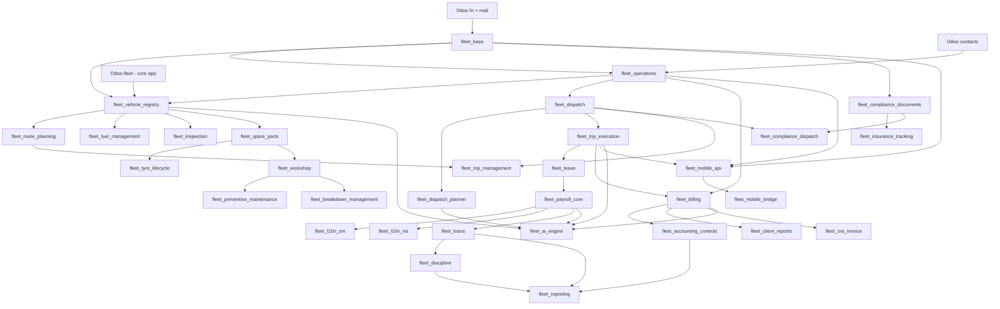

# 04 — Proposed DeployFleet Module Structure

This is the target module list resulting from the audit in [01-module-audit.md](01-module-audit.md), applying the naming convention from [03-refactoring-roadmap.md](03-refactoring-roadmap.md). It assumes the recommended decision from that document — DeployFleet extends Odoo's native `fleet.vehicle`/`fleet` app rather than reinventing vehicle master data — pending confirmation.

## Design principles

1. **Fleet, dispatch, and compliance are the product core** — they get more, smaller modules than DeployGuard gave them, because independent installability, focused security groups, and isolated test suites matter more for a product's differentiator than for its supporting cast.
2. **HR/payroll/billing stay coarse-grained** — they were already well-factored as generic engines; splitting them further would just add manifest overhead without a corresponding boundary benefit.
3. **No module should be forced to install country-specific logic to get country-neutral behavior** — this is the `fleet_payroll_core`/`fleet_l10n_zm` decoupling fix from [03-refactoring-roadmap.md](03-refactoring-roadmap.md) applied as a structural rule, not just a payroll-specific patch.
4. **Bridges stay bridges.** Cross-cutting modules (`fleet_fleet_ops`-style bridges, `*_payroll_bridge`, `*_crm`, `*_sale`, `*_account`) remain separate, thin, and `auto_install`-able where the source used that pattern — this keeps the core modules installable without their optional integrations.

## Module list

### Foundation

| Module | Depends | Purpose |
|---|---|---|
| `fleet_base` | `hr`, `mail`, `web` | Driver profile (extends `hr.employee`), license classes, endorsements, qualifications, reliability score, core Fleet role groups |
| `deployfleet_licensing` | `base`, `mail`, `web` | Product entitlement/license enforcement |
| `deployfleet_theme` | `web`, `base_setup`, `fleet_base` | White-label branding, PDF theming |
| `deployfleet_help` | `web`, `fleet_base` | In-app help centre |
| `deployfleet_tour` | `web`, `web_tour`, `fleet_base`, `deployfleet_help`, `deployfleet_theme` | Product tours & onboarding |
| `deployfleet_backup_vault` | `base`, `fleet_base` | Backup/offsite sync |
| `fleet_reconciliation_core` | `fleet_base`, `mail` | Cross-module sync/audit framework |

### Operations & dispatch

| Module | Depends | Purpose |
|---|---|---|
| `fleet_operations` | `fleet_base`, `contacts` | Clients, contracts/lanes, depots/terminals, demand planning |
| `fleet_dispatch` | `fleet_operations` | Trip requirements, dispatch batches, trip assignments — the direct successor to `security_operations`'s roster batch/slot |
| `fleet_dispatch_planner` | `fleet_dispatch`, `fleet_base`, `web` | Constraint-satisfaction driver↔vehicle↔trip scoring, Dispatch Board OWL client |
| `fleet_trip_execution` | `fleet_dispatch`, `web` | Planned-vs-actual trip records: departure/arrival, odometer, delay reason |
| `fleet_compliance_dispatch` | `fleet_compliance_documents`, `fleet_dispatch`, `fleet_base` | Blocks dispatch against expired driver/vehicle documents, with emergency-override audit trail |
| `fleet_client_onboarding` | `fleet_operations`, `fleet_billing` | Wizard: contract → routes/lanes → rate card → billing plan → first trip schedule |
| `fleet_operations_crm` | `fleet_operations`, `crm`, `fleet_base` | Syncs on-time %, breakdown rate, utilization to CRM opportunities |

### Fleet & maintenance (product core)

| Module | Depends | Purpose |
|---|---|---|
| *(Odoo core)* `fleet` | — | Native vehicle/model/brand master data, base fuel/service/odometer logs — dependency, not ours |
| `fleet_vehicle_registry` | `fleet` *(core)*, `fleet_base`, `fleet_operations` | Extends `fleet.vehicle` with VIN, axle config, GVW, registration/permit fields |
| `fleet_route_planning` | `fleet_vehicle_registry`, `fleet_operations` | Routes, route stops, lane distances |
| `fleet_trip_management` | `fleet_route_planning`, `fleet_dispatch` | Trip records, cargo/load manifest (successor to `SecurityShuttleRun`/`Passenger`) |
| `fleet_fuel_management` | `fleet_vehicle_registry`, `fleet` *(core)* | Fuel logs, consumption analytics, anomaly flags |
| `fleet_inspection` | `fleet_vehicle_registry` | Pre-trip/post-trip inspection checklists |
| `fleet_spare_parts` | `fleet_vehicle_registry` | Parts categories, items, stock alerts |
| `fleet_tyre_lifecycle` | `fleet_vehicle_registry`, `fleet_spare_parts` | Tread depth readings, position tracking, rotation/retread/scrap history |
| `fleet_workshop` | `fleet_vehicle_registry`, `fleet_spare_parts` | Job cards: open → diagnose → repair (labor + parts) → approve → close |
| `fleet_preventive_maintenance` | `fleet_vehicle_registry`, `fleet_workshop` | Odometer/engine-hour/calendar service scheduling |
| `fleet_breakdown_management` | `fleet_vehicle_registry`, `fleet_workshop`, `mail` | Breakdown/incident logging, severity, resolution |
| `fleet_insurance_tracking` | `fleet_compliance_documents`, `fleet_vehicle_registry` | Policy, premium, claims |
| `fleet_workshop_payroll_bridge` | `fleet_workshop`, `fleet_payroll_core`, `fleet_base` | Unreturned-tool/vehicle-damage payroll deductions, low-stock alerts |
| `fleet_operations_bridge` | `fleet_trip_management`, `fleet_trip_execution`, `fleet_operations`, `fleet_base` | Vehicle-event ↔ ops ↔ trip-execution bridge (direct successor to `security_fleet_ops`) |
| `fleet_compliance_documents` | `fleet_base` | Polymorphic document-type/expiry/verification engine (driver *and* vehicle documents) |

### HR & payroll

| Module | Depends | Purpose |
|---|---|---|
| `fleet_payroll_core` | `fleet_operations`, `fleet_leave`, `web` | Payroll pipeline — **no dependency on any country pack** (fixes the source's coupling bug) |
| `fleet_l10n_zm` | `fleet_payroll_core` | Zambia NAPSA/NHIMA/WCF/PAYE, ZM payslip |
| `fleet_l10n_na` | `fleet_payroll_core` | Namibia pack, dormant until regional expansion |
| `fleet_leave` | `fleet_trip_execution` | Leave types, balances, requests |
| `fleet_loans` | `fleet_payroll_core` | Employee loans, payslip deductions |
| `fleet_discipline` | `fleet_loans`, `mail` | Behavioral incidents, reliability impact |
| `fleet_discipline_payroll_bridge` | `fleet_trip_execution`, `fleet_discipline`, `fleet_payroll_core`, `fleet_base` | Reliability index, progressive discipline, automated penalties |

### Billing & finance

| Module | Depends | Purpose |
|---|---|---|
| `fleet_billing` | `fleet_operations`, `fleet_trip_execution`, `account` | Contracts, rate cards (per-trip/tonnage/distance/lane), invoice generation, Billing Command Center |
| `fleet_accounting_controls` | `fleet_billing` | Payment tracking, ageing |
| `fleet_client_reports` | `fleet_billing`, `fleet_reporting`, `fleet_operations`, `fleet_trip_execution` | Client-facing shipment/trip summaries |
| `fleet_billing_account` | `fleet_billing`, `account`, `fleet_accounting_controls`, `fleet_reconciliation_billing_account` | Bridge to standard customer invoices |
| `fleet_billing_crm` | `fleet_billing`, `crm` | Bridge to CRM leads/opportunities |
| `fleet_billing_sale` | `fleet_billing`, `sale` | Bridge to Sales Orders |
| `fleet_reconciliation_billing_account` | `fleet_reconciliation_core`, `fleet_billing`, `account`, `fleet_accounting_controls` | Invoice/payment/credit-note reconciliation |
| `fleet_zra_invoice` | `fleet_billing`, `fleet_operations` | Zambia ZRA Smart Invoice (VSDC) |

### Reporting & notifications

| Module | Depends | Purpose |
|---|---|---|
| `fleet_reporting` | `web`, `fleet_accounting_controls`, `fleet_discipline`, `fleet_loans` | Pivot/graph dashboards |
| `fleet_notifications` | `fleet_compliance_documents`, `fleet_leave`, `fleet_billing`, `fleet_trip_execution`, `mail` | Internal alerts: document expiry, maintenance due, overdue invoices |

### Mobile, portal, AI

| Module | Depends | Purpose |
|---|---|---|
| `fleet_mobile_api` | `fleet_base`, `fleet_trip_execution`, `fleet_operations` | REST JSON controllers: driver / dispatcher / fleet-manager / owner |
| `fleet_mobile_bridge` | `fleet_mobile_api`, `fleet_base` | Event bus → Expo push notifications |
| `fleet_customer_portal` | `portal`, `fleet_operations`, `fleet_trip_execution`, `fleet_base` | Shipment status, active trips, POD, feedback |
| `fleet_ai_engine` | `fleet_billing`, `fleet_dispatch_planner`, `fleet_trip_execution`, `fleet_discipline`, `fleet_leave`, `fleet_compliance_documents`, `fleet_payroll_core`, `fleet_vehicle_registry`, `web` | Multi-provider AI facade + 10 fleet-relevant features |
| `fleet_ai_whatsapp_bridge` | `hr`, `fleet_operations`, `fleet_trip_execution`, `fleet_base`, `fleet_ai_engine` | WhatsApp check-in / breakdown reporting / dispatcher alerts |

### Meta & demo

| Module | Depends | Purpose |
|---|---|---|
| `deployfleet_suite` | all of the above | One-step installer |
| `deployfleet_demo_data_zm` | core operational + payroll modules | Zambia trucking demo dataset — written fresh, no DogForce content |
| `deployfleet_demo_site` | `web`, `base`, `deployfleet_theme`, `deployfleet_suite` | Demo login panel / sandbox management |

**Total: ~43 modules** (vs. 45 in the source), organized into 8 layers instead of the source's implicit 6.

## Dependency graph (simplified)

## Suggested install profiles

Not every deployment needs every module on day one — install profiles give sales/onboarding a clean story:

| Profile | Modules |
|---|---|
| **Core Dispatch** (MVP, see [05-implementation-roadmap.md](05-implementation-roadmap.md)) | `fleet_base`, `fleet_operations`, `fleet_dispatch`, `fleet_dispatch_planner`, `fleet_trip_execution`, `fleet_vehicle_registry`, `fleet_route_planning`, `fleet_trip_management` |
| **+ Workshop** | `fleet_fuel_management`, `fleet_inspection`, `fleet_spare_parts`, `fleet_tyre_lifecycle`, `fleet_workshop`, `fleet_preventive_maintenance`, `fleet_breakdown_management` |
| **+ Compliance** | `fleet_compliance_documents`, `fleet_compliance_dispatch`, `fleet_insurance_tracking` |
| **+ Payroll & HR** | `fleet_payroll_core`, `fleet_l10n_zm`, `fleet_leave`, `fleet_loans`, `fleet_discipline` |
| **+ Billing** | `fleet_billing`, `fleet_accounting_controls`, `fleet_client_reports`, `fleet_zra_invoice` |
| **+ Mobile & Portal** | `fleet_mobile_api`, `fleet_mobile_bridge`, `fleet_customer_portal` |
| **+ AI & Automation** | `fleet_ai_engine`, `fleet_ai_whatsapp_bridge` |
| **Everything** | `deployfleet_suite` |
