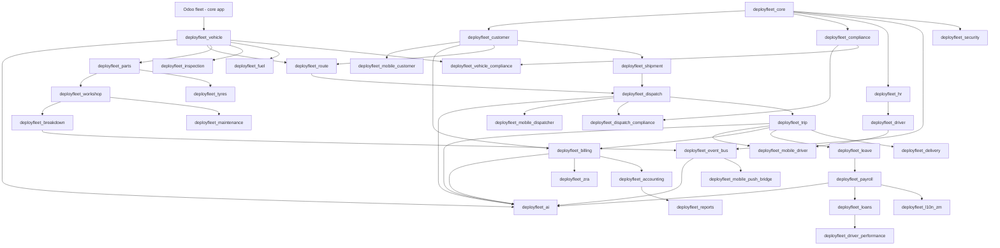

# 04 — Proposed DeployFleet Module Structure

*Revision 2 — adopts the `deployfleet_*` namespace throughout, the domain-grouping structure from architecture review (Foundation / People / Fleet Assets / Operations / Finance / Reporting / Mobile / Intelligence), the vehicle-delegation pattern from [03-refactoring-roadmap.md](03-refactoring-roadmap.md), the event bus as a foundation-layer module, the 3-way equipment split (parts/tyres/assets), the 3-way mobile split, and the MVP-12 first-release scope — reconciled against the more granular bridge/localization modules this document already had in v1 where the two didn't conflict.*

## Design principles

1. **Fleet, dispatch, and compliance are the product core** — they get more, smaller modules than DeployGuard gave them, because independent installability, focused security groups, and isolated test suites matter more for a product's differentiator than for its supporting cast.
2. **HR/payroll/billing stay coarse-grained** — already well-factored as generic engines; splitting further adds manifest overhead without a boundary benefit.
3. **No module should be forced to install country-specific logic to get country-neutral behavior** — the `deployfleet_payroll`/`deployfleet_l10n_zm` decoupling from [03-refactoring-roadmap.md](03-refactoring-roadmap.md) applied as a structural rule.
4. **Infrastructure modules are not "sellable features," and shouldn't be counted the same way in scoping conversations.** `deployfleet_core`, `deployfleet_security`, `deployfleet_event_bus`, `deployfleet_theme`, `deployfleet_notifications`, and `deployfleet_backup` are substrate every install needs; they don't belong in a "here are our 12 modules" sales conversation any more than PostgreSQL does. Keep that distinction explicit — see the MVP section below, where this matters.
5. **Bridges stay bridges.** Cross-cutting modules (CRM/Sale/Account integrations, payroll bridges) remain separate, thin, and `auto_install`-able — core modules stay installable without their optional integrations.

## Module list

### Foundation (infrastructure substrate — always installed, not a "feature")

| Module | Depends | Purpose |
|---|---|---|
| `deployfleet_core` | `hr`, `mail`, `web` | Company/role identity base, shared mixins, module category. *(For the MVP release, the event-bus model described below ships inside this module rather than as a separate manifest — see the MVP note.)* |
| `deployfleet_security` | `deployfleet_core`, `base`, `web` | Role groups (`group_deployfleet_driver` → `dispatcher` → `manager` → `owner`, plus HR/Payroll Officer and Auditor), plus product license/entitlement enforcement — merged per review naming rather than kept as a separate `_licensing` module. |
| `deployfleet_event_bus` | `deployfleet_core`, `mail` | The promoted, generalized event bus (see [02-reuse-strategy.md](02-reuse-strategy.md) §0) — `deployfleet.event.log` publish/dispatch model with a subscriber-registry table instead of the source's hardcoded if-chain. Every operational module below publishes onto this; notifications, mobile push, AI, and CRM-sync subscribe. |
| `deployfleet_theme` | `web`, `base_setup`, `deployfleet_core` | White-label branding, PDF theming |
| `deployfleet_help` | `web`, `deployfleet_core` | In-app help centre |
| `deployfleet_backup` | `base`, `deployfleet_core` | Backup/offsite sync |
| `deployfleet_notifications` | `deployfleet_event_bus`, `deployfleet_core`, `mail` | Internal alert model, daily crons, and a bus subscriber for time-critical events |

### People

| Module | Depends | Purpose |
|---|---|---|
| `deployfleet_hr` | `hr`, `deployfleet_core` | General staff administration for non-driver roles — dispatchers, mechanics, admin — kept distinct from driver-specific data per review feedback ("a driver is not just an employee"). |
| `deployfleet_driver` | `deployfleet_hr`, `hr` | Driver profile (`_inherit` on `hr.employee`): license class, endorsements, truck-type qualifications, experience, accident history, computed risk/fuel-efficiency scores. |
| `deployfleet_payroll` | `deployfleet_core`, `deployfleet_leave`, `web` | Payroll pipeline — no dependency on any country pack |
| `deployfleet_l10n_zm` | `deployfleet_payroll` | Zambia NAPSA/NHIMA/WCF/PAYE, ZM payslip |
| `deployfleet_l10n_na` | `deployfleet_payroll` | Namibia pack, dormant until regional expansion |
| `deployfleet_leave` | `deployfleet_trip` | Leave types, balances, requests |
| `deployfleet_loans` | `deployfleet_payroll` | Employee loans, payslip deductions |
| `deployfleet_driver_performance` | `deployfleet_loans`, `mail` | Accidents, violations, harsh-braking/speeding events, fuel-abuse patterns, late deliveries → reliability score impact, optional payroll deduction. Reframed from "discipline" per review — this is a safety/performance signal, not an HR conduct write-up. |
| `deployfleet_driver_performance_payroll_bridge` | `deployfleet_trip`, `deployfleet_driver_performance`, `deployfleet_payroll` | Reliability index, progressive intervention, automated penalties |
| `deployfleet_training` | `deployfleet_driver` | Driver certification/refresher training records — net-new, low priority, not in MVP |

### Fleet assets (product core)

| Module | Depends | Purpose |
|---|---|---|
| *(Odoo core)* `fleet` | — | Native vehicle/model/brand master data, base fuel/service/odometer logs — dependency, not ours |
| `deployfleet_vehicle` | `fleet` *(core)*, `deployfleet_core` | `deployfleet.vehicle` delegating to `fleet.vehicle` (see [03-refactoring-roadmap.md](03-refactoring-roadmap.md) §A.2): operational status (available/assigned/maintenance/breakdown/retired), current driver, current trip |
| `deployfleet_vehicle_compliance` | `deployfleet_vehicle`, `deployfleet_compliance` | Vehicle-side application of the compliance engine: insurance, roadworthiness, permits, licensing; feeds dispatch-blocking checks |
| `deployfleet_fuel` | `deployfleet_vehicle`, `fleet` *(core)* | Fuel logs, consumption analytics, anomaly flags |
| `deployfleet_inspection` | `deployfleet_vehicle` | Pre-trip/post-trip inspection checklists |
| `deployfleet_parts` | `deployfleet_vehicle` | Parts categories, items, stock alerts |
| `deployfleet_tyres` | `deployfleet_vehicle`, `deployfleet_parts` | Tread depth readings, position tracking, rotation/retread/scrap history |
| `deployfleet_assets` | `deployfleet_core` | Non-vehicle trackable assets — trailers, containers, GPS trackers, tools, safety equipment |
| `deployfleet_workshop` | `deployfleet_vehicle`, `deployfleet_parts` | Job cards: open → diagnose → repair (labor + parts) → approve → close |
| `deployfleet_maintenance` | `deployfleet_vehicle`, `deployfleet_workshop` | Odometer/engine-hour/calendar preventive service scheduling; publishes `deployfleet.maintenance.due` |
| `deployfleet_breakdown` | `deployfleet_vehicle`, `deployfleet_workshop`, `deployfleet_event_bus` | Breakdown logging, severity, resolution; publishes `deployfleet.vehicle.breakdown` |
| `deployfleet_insurance` | `deployfleet_compliance`, `deployfleet_vehicle` | Policy, premium, claims |
| `deployfleet_workshop_payroll_bridge` | `deployfleet_workshop`, `deployfleet_payroll` | Unreturned-tool/vehicle-damage payroll deductions, low-stock alerts |
| `deployfleet_fleet_ops_bridge` | `deployfleet_trip`, `deployfleet_vehicle`, `deployfleet_event_bus` | Vehicle-event ↔ ops ↔ trip bridge, already event-driven in the source — keep that shape |
| `deployfleet_compliance` | `deployfleet_core` | Polymorphic document-type/expiry/verification engine — the shared foundation both driver and vehicle compliance build on |

### Operations — the heart of the product

| Module | Depends | Purpose |
|---|---|---|
| `deployfleet_customer` | `deployfleet_core`, `contacts` | Clients, contracts/lanes, depots/terminals |
| `deployfleet_shipment` | `deployfleet_customer` | **The module the review correctly identified as missing from v1.** Cargo/load: what, how much, pickup, drop-off, weight, per-shipment customer terms. One shipment fulfilled by one or more trips. *For the MVP release this ships as models inside `deployfleet_dispatch` rather than a separate manifest — see the MVP note — but the entity must exist in the schema from day one regardless of module packaging, per [07-domain-model-erd.md](07-domain-model-erd.md).* |
| `deployfleet_route` | `deployfleet_vehicle`, `deployfleet_customer` | Routes, route stops, lane distances |
| `deployfleet_dispatch` | `deployfleet_customer`, `deployfleet_route` | Trip requirements, dispatch batches, driver↔vehicle↔trip constraint-satisfaction scoring, Dispatch Board OWL client |
| `deployfleet_trip` | `deployfleet_dispatch` | Trip records, planned-vs-actual (departure/arrival, odometer, delay reason); publishes `deployfleet.trip.departed` / `deployfleet.trip.delayed` |
| `deployfleet_delivery` | `deployfleet_trip` | Proof-of-delivery: signature, photo, GPS stamp, recipient; publishes `deployfleet.delivery.completed` |
| `deployfleet_dispatch_compliance` | `deployfleet_compliance`, `deployfleet_dispatch` | Blocks dispatch against expired driver/vehicle documents, emergency-override + audit trail |
| `deployfleet_customer_onboarding` | `deployfleet_customer`, `deployfleet_billing` | Wizard: contract → routes/lanes → rate card → billing plan → first shipment |
| `deployfleet_operations_crm` | `deployfleet_customer`, `crm` | Syncs on-time %, breakdown rate, utilization to CRM opportunities — bus subscriber |

### Finance

| Module | Depends | Purpose |
|---|---|---|
| `deployfleet_billing` | `deployfleet_customer`, `deployfleet_trip`, `account` | Contracts, rate cards (per-trip/tonnage/distance/lane), invoice generation, Billing Command Center |
| `deployfleet_accounting` | `deployfleet_billing` | Payment tracking, ageing (source: `security_accounting_controls`) |
| `deployfleet_client_reports` | `deployfleet_billing`, `deployfleet_reports`, `deployfleet_trip` | Client-facing shipment/trip summaries |
| `deployfleet_billing_account` | `deployfleet_billing`, `account`, `deployfleet_accounting` | Bridge to standard customer invoices |
| `deployfleet_billing_crm` | `deployfleet_billing`, `crm` | Bridge to CRM leads/opportunities |
| `deployfleet_sales` | `deployfleet_billing`, `sale` | Bridge to Sales Orders (source: `security_billing_sale`) |
| `deployfleet_reconciliation` | `deployfleet_billing`, `account`, `deployfleet_accounting` | Invoice/payment/credit-note reconciliation |
| `deployfleet_zra` | `deployfleet_billing`, `deployfleet_customer` | Zambia ZRA Smart Invoice (VSDC) |

### Reporting

| Module | Depends | Purpose |
|---|---|---|
| `deployfleet_reports` | `web`, `deployfleet_accounting`, `deployfleet_driver_performance`, `deployfleet_loans` | Pivot/graph dashboards |

### Mobile & portal

| Module | Depends | Purpose |
|---|---|---|
| `deployfleet_mobile_driver` | `deployfleet_driver`, `deployfleet_trip` | Driver-facing endpoints/app: assigned trip, check-in/out, delivery capture |
| `deployfleet_mobile_dispatcher` | `deployfleet_dispatch`, `deployfleet_trip` | Dispatcher-facing endpoints/app: real-time board, overtime/exception approval |
| `deployfleet_mobile_customer` | `deployfleet_customer`, `deployfleet_shipment` | Read-mostly shipment tracking for customers |
| `deployfleet_mobile_push_bridge` | `deployfleet_event_bus` | Event bus → Expo push notifications, already event-driven in the source |
| `deployfleet_customer_portal` | `portal`, `deployfleet_customer`, `deployfleet_trip` | Shipment status, active trips, POD, feedback |

### Intelligence

| Module | Depends | Purpose |
|---|---|---|
| `deployfleet_ai` | `deployfleet_billing`, `deployfleet_dispatch`, `deployfleet_trip`, `deployfleet_driver_performance`, `deployfleet_compliance`, `deployfleet_payroll`, `deployfleet_vehicle`, `deployfleet_event_bus`, `web` | Multi-provider AI facade + fleet-relevant features (fuel anomaly, predictive maintenance, dispatch assistant, driver risk, payment-risk) — see [02-reuse-strategy.md](02-reuse-strategy.md) |
| `deployfleet_ai_whatsapp` | `deployfleet_hr`, `deployfleet_customer`, `deployfleet_trip`, `deployfleet_ai` | WhatsApp check-in / breakdown reporting / dispatcher alerts |

### Meta & demo

| Module | Depends | Purpose |
|---|---|---|
| `deployfleet_suite` | all of the above | One-step installer |
| `deployfleet_demo_data_zm` | core operational + payroll modules | Zambia trucking demo dataset — written fresh |
| `deployfleet_demo_site` | `web`, `base`, `deployfleet_theme`, `deployfleet_suite` | Demo login panel / sandbox management |

**Total: ~48 modules** across 8 groupings, matching the audit in [01-module-audit.md](01-module-audit.md).

## Dependency graph (simplified)

## First commercial release: MVP-12

Per architecture review: **do not build all ~48 modules before the first sale.** The first sellable product is a focused 12-module set — plus the infrastructure substrate every install needs regardless (principle 4 above), which isn't counted against the "12" the same way Postgres isn't:

| # | Module | Why it's in the MVP |
|---|---|---|
| 1 | `deployfleet_core` | Substrate (ships the event bus's initial implementation inline — see note below) |
| 2 | `deployfleet_driver` | A trucking company can't dispatch without driver records |
| 3 | `deployfleet_vehicle` | Or without vehicle records |
| 4 | `deployfleet_dispatch` | The core scheduling loop — includes shipment/load fields inline for the MVP (see note below) |
| 5 | `deployfleet_trip` | Planned vs. actual execution |
| 6 | `deployfleet_delivery` | Proof of delivery — the moment a customer actually cares about |
| 7 | `deployfleet_fuel` | Immediate, visible cost-control value |
| 8 | `deployfleet_maintenance` | Same — prevents an even more expensive cost (breakdowns) |
| 9 | `deployfleet_compliance` | Documents/expiry — insurance and licensing lapses are a liability from day one, not a Phase 3 nice-to-have |
| 10 | `deployfleet_billing` | The company needs to invoice its customers |
| 11 | `deployfleet_mobile_driver` | Field usability — start with the driver app; dispatcher and customer apps follow once the driver flow is proven |
| 12 | `deployfleet_reports` | Basic visibility without waiting for the full BI/AI story |

**Two packaging notes worth being explicit about, since the MVP list and the fuller module list above don't literally match module-for-module:**

- **Shipment/load** is a first-class *entity* from day one (see [07-domain-model-erd.md](07-domain-model-erd.md)) — the review's core point that "a trip without cargo is meaningless" stands regardless of MVP scope. For the MVP, its models simply live inside `deployfleet_dispatch`'s manifest rather than a separate `deployfleet_shipment` module, to keep the *module count* at 12 without losing the *concept*. Split it into its own module once contract/load complexity (multi-leg shipments, consolidated loads) grows enough to justify independent versioning.
- **The event bus** ships as part of `deployfleet_core` for the MVP, for the same reason — it's substrate, not a sales-pitch line item, but per [02-reuse-strategy.md](02-reuse-strategy.md) §0 it should still be designed and built as the generalized, subscriber-registry version from day one, not the source's hardcoded-if-chain version. Split it into its own `deployfleet_event_bus` module once enough subscribers exist (compliance, maintenance, AI, notifications) to justify independent lifecycle.

Everything else — workshop, tyres, parts, assets, insurance, driver performance, payroll/l10n, dispatcher and customer mobile, CRM/Sales/Accounting bridges, AI, WhatsApp — is a deliberate **expansion module**, sequenced in [05-implementation-roadmap.md](05-implementation-roadmap.md), not a "we'll get to it eventually, undated" backlog.
