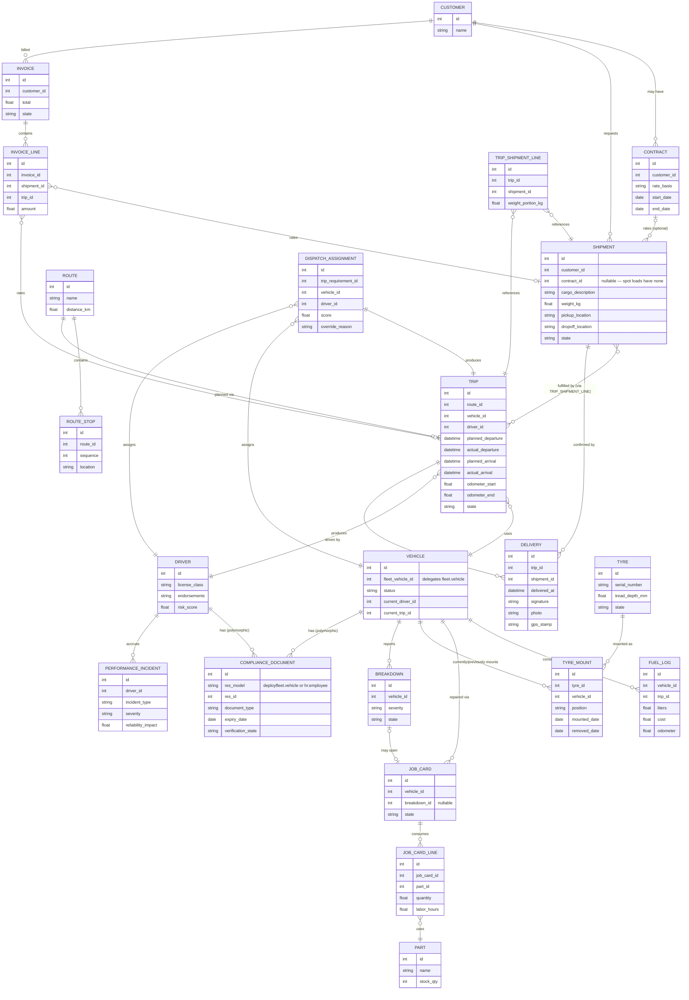
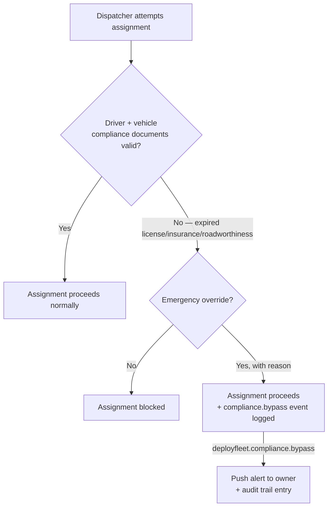
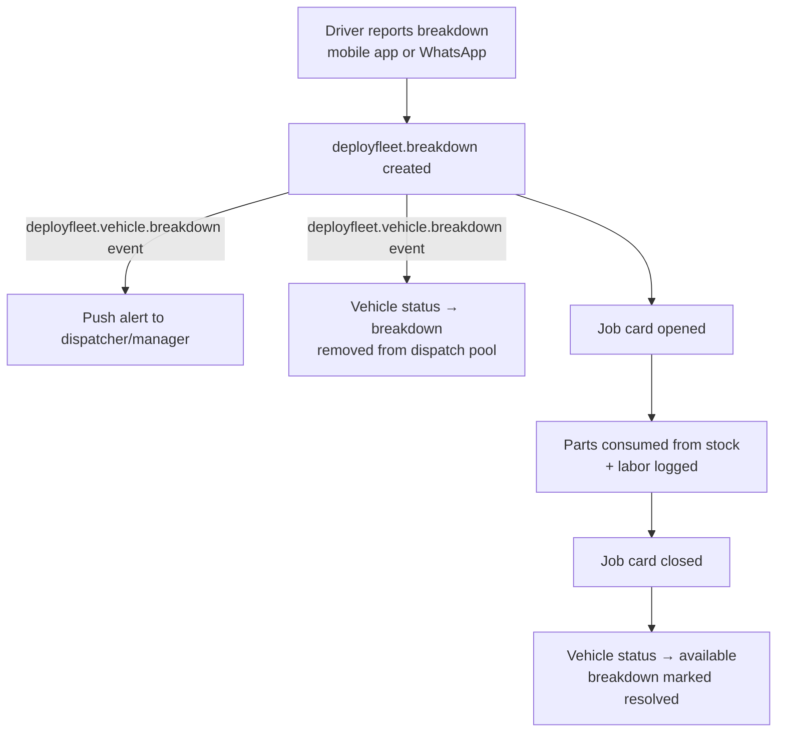
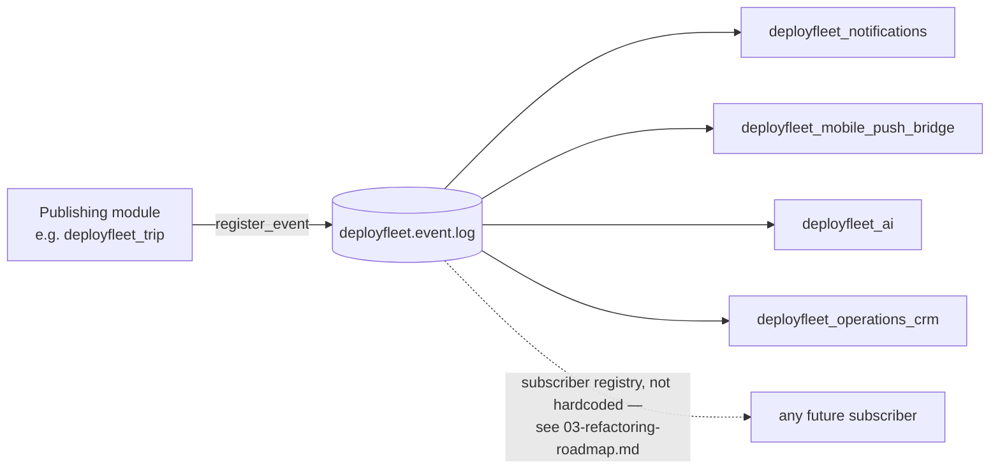

# 07 — DeployFleet Domain Model / ERD

Requested directly by architecture review as the next step before any coding: "create the DeployFleet Domain Model / ERD (entities, relationships, workflows) because that will determine whether this becomes a clean commercial product or another customized ERP project."

This is the reference schema [05-implementation-roadmap.md](05-implementation-roadmap.md) Phase 1 builds against. **Treat it as a draft pending the real-world validation flagged in [06-risks-and-recommendations.md](06-risks-and-recommendations.md) risk #4** — it is derived from the DeployGuard codebase's shape plus the corrected domain vocabulary from review (Customers → Shipments → Routes → Vehicles + Drivers → Trips → Deliveries → Billing), not yet from a working session with a real Zambian trucking operator. Where this schema is likely to bend under real-world dispatch patterns (spot loads, backhauls, consolidated cargo, owner-operators), the entity notes below say so explicitly.

## 1. Entity overview

| Entity | Technical model | New / extends core | Notes |
|---|---|---|---|
| Customer | `res.partner` | Odoo core, unchanged | No new model — a customer is a partner, same as any Odoo app |
| Contract | `deployfleet.contract` | New | Optional recurring commercial terms with a customer — **not required** for a shipment to exist (see §3, spot loads) |
| Shipment / Load | `deployfleet.shipment` | New | The cargo-level commercial unit — what review correctly identified as missing from v1 |
| Route | `deployfleet.route` | New | A named, reusable path (e.g. "Lusaka → Kitwe") |
| Route Stop | `deployfleet.route.stop` | New | Ordered waypoints on a route |
| Dispatch Assignment | `deployfleet.dispatch.assignment` | New | The planning-time pairing of driver + vehicle + trip requirement, scored by the constraint engine |
| Trip | `deployfleet.trip` | New | The execution-time record: planned vs. actual departure/arrival, odometer, delay reason |
| Trip–Shipment Line | `deployfleet.trip.shipment.line` | New (join model) | Many-to-many between trip and shipment — see §3 |
| Delivery | `deployfleet.delivery` | New | Proof-of-delivery for one shipment (or shipment line) on one trip |
| Vehicle | `deployfleet.vehicle` | Delegates `fleet.vehicle` (`_inherits`) | See [03-refactoring-roadmap.md](03-refactoring-roadmap.md) §A.2 |
| Driver | `hr.employee` (`_inherit`) | Extends core | License class, endorsements, qualifications, risk score |
| Compliance Document | `deployfleet.compliance.document` | New, polymorphic | `res_model`/`res_id` link to either `deployfleet.vehicle` or `hr.employee` (driver) |
| Fuel Log | `deployfleet.fuel.log` | New (or extends `fleet.vehicle.log.fuel`) | Consumption tracking per vehicle/trip |
| Tyre | `deployfleet.tyre` | New | Independent lifecycle entity, not just an equipment type |
| Tyre Mount History | `deployfleet.tyre.mount` | New (join model) | Tracks which vehicle/position a tyre has been mounted on over time |
| Job Card | `deployfleet.job.card` | New | Workshop repair workflow |
| Job Card Line | `deployfleet.job.card.line` | New | Parts/labor consumed by a job card |
| Part | `deployfleet.part` | New | Spare parts inventory item |
| Asset | `deployfleet.asset` | New | Trailers, containers, tools, safety equipment — non-vehicle, non-part |
| Breakdown | `deployfleet.breakdown` | New | Mechanical incident, feeds a job card |
| Driver Performance Incident | `deployfleet.driver.performance.incident` | New | Accidents, violations, harsh events (reframed from "discipline") |
| Invoice | `deployfleet.billing.invoice` | New | Customer-facing invoice |
| Invoice Line | `deployfleet.billing.invoice.line` | New | Rated against shipment/trip/tonnage/distance |
| Event Log | `deployfleet.event.log` | New | The event bus — cross-cutting, not a normal relational entity (see §4) |

## 2. Entity-relationship diagram

## 3. Design notes and open validation points

These are the specific places this schema makes a judgment call that [06-risks-and-recommendations.md](06-risks-and-recommendations.md) risk #4 flags as needing real-world confirmation:

- **Shipment ↔ Trip is many-to-many, on purpose.** A single trip can carry multiple shipments (consolidated/mixed cargo for different customers), and a single shipment can require multiple trips (a multi-leg move, or a large load split across two trucks). The join model `deployfleet.trip.shipment.line` carries the weight/quantity portion per pairing. **If real dispatch practice among target customers is simpler than this (always one shipment per trip)**, the join model still works — it just always has exactly one line — so this is a safe default to build against even before validation, unlike the alternative of hardcoding a one-to-one relationship and having to retrofit multi-shipment trips later.
- **Contract on a shipment is optional (`contract_id` is nullable).** This directly supports the spot-load pattern review flagged (cargo booked ad hoc, no standing contract) without requiring a design change — a spot load is simply a shipment with no contract, priced directly on the invoice line instead of via contract rate terms.
- **Dispatch Assignment is a distinct entity from Trip**, even though in the simplest case there's a 1:1 relationship between them. This preserves the planning-vs-execution distinction that made DeployGuard's roster-slot/attendance-record split valuable (a plan can be revised before it becomes a committed trip; the scoring engine's output is auditable separately from what actually happened).
- **Delivery is keyed to (trip, shipment) not just (trip)** — a multi-drop trip carrying three shipments produces three deliveries, one per drop, each with its own POD. This is necessary the moment the many-to-many shipment/trip relationship above is used for real.
- **Owner-operator vs. company-owned vehicle** is not yet modeled as a distinct concept — today `deployfleet.vehicle` doesn't distinguish who owns the truck. If the target market has a meaningful mix of owner-operator trucks (common in regional logistics), this schema needs an `ownership_type` field and probably a different billing/payroll treatment (an owner-operator is paid per trip/contract, not payrolled as an employee-driver) — flagged here explicitly as a gap, not silently assumed away.
- **Backhauls** (a return trip picking up different cargo for a different customer) work naturally under this schema — it's just a second `deployfleet.trip` on the same vehicle/driver assignment chain, carrying a different shipment. No schema change needed if this pattern is confirmed common; noted here so it isn't mistaken for an unhandled case during validation conversations.

## 4. The event bus is cross-cutting, not a relational edge

`deployfleet.event.log` (see [02-reuse-strategy.md](02-reuse-strategy.md) §0) deliberately does not appear as a foreign-key relationship in §2 — it's a publish/subscribe log, not a normal entity reference. Key event names this schema implies, based on the entities above and the source's existing event names:

| Event | Published by | Consumed by (typical) |
|---|---|---|
| `deployfleet.trip.departed` / `deployfleet.trip.delayed` | `deployfleet.trip` | Notifications, customer portal, AI |
| `deployfleet.delivery.completed` | `deployfleet.delivery` | Billing (triggers invoice line generation), notifications, customer portal |
| `deployfleet.vehicle.breakdown` | `deployfleet.breakdown` | Mobile push (dispatcher/manager), workshop (opens a job card), AI |
| `deployfleet.maintenance.due` | `deployfleet.vehicle` (computed from odometer/calendar) | Notifications, workshop |
| `deployfleet.compliance.expired` / `deployfleet.compliance.bypass` | `deployfleet.compliance.document`, `deployfleet.dispatch.assignment` | Mobile push (owner), notifications, audit log |
| `deployfleet.dispatch.assigned` | `deployfleet.dispatch.assignment` | Mobile push (driver), CRM sync |

## 5. Key workflows

### 5.1 Happy path: shipment intake → invoice

```mermaid
flowchart LR
    A[Customer requests shipment] --> B[Shipment created<br/>contract optional]
    B --> C[Dispatch: score driver + vehicle<br/>against trip requirement]
    C --> D[Dispatch Assignment confirmed]
    D --> E[Trip created<br/>planned departure/arrival]
    E --> F[Trip executes<br/>actual departure, odometer, GPS]
    F --> G[Delivery captured<br/>signature/photo/GPS]
    G -->|deployfleet.delivery.completed| H[Invoice line generated]
    H --> I[Invoice sent<br/>+ ZRA submission if Zambia]
```

### 5.2 Compliance block at dispatch time

### 5.3 Breakdown → workshop → resolution

### 5.4 Event bus fan-out (generic shape)

## 6. What this document is not

This is a **draft reference schema for Phase 1 implementation**, not a finished data dictionary — field types, constraints, and computed-field logic are illustrative (see the `erDiagram` attribute lists in §2), not final DDL. The real design step still owed, per [06-risks-and-recommendations.md](06-risks-and-recommendations.md) risk #4, is validating §3's judgment calls (many-to-many shipment/trip, optional contract, missing owner-operator distinction) against actual dispatch conversations with target Zambian trucking operators before Phase 1 schema is frozen.
