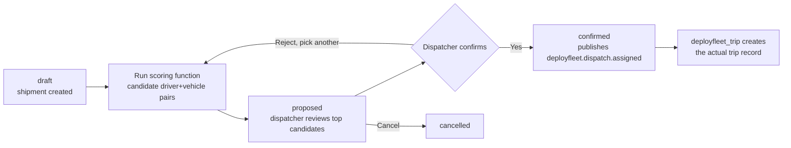

# 09 — Dispatch Module Design

`deployfleet_dispatch` is the highest-risk, most novel piece of Phase 1 — everything else in the Operational Foundation phase (driver, vehicle, customer, route) is close to a direct port of DeployGuard's identity/master-data layer, but dispatch is the genuine domain remodel from `roster batch → roster slot` into `shipment → dispatch assignment → trip`. This document is the plan for it, written before implementation per the same pattern used for AI in [08-ai-architecture.md](08-ai-architecture.md): design first, then build against the design, not the reverse.

**Context this plan is written under:** a real trucking company will be using the system soon. That's good news for risk #5 in [06-risks-and-recommendations.md](06-risks-and-recommendations.md) — it's the validation opportunity that document called for — but it also means this module is going live under real time pressure rather than after a leisurely discovery phase. This plan proceeds against the domain model already designed in [07-domain-model-erd.md](07-domain-model-erd.md) as the working baseline, and calls out explicitly, inline, which specific assumptions are cheapest to get confirmed early with the real customer, rather than treating the whole schema as equally uncertain.

## 1. Scope decision: what ships in Phase 1 vs. what's a fast-follow

Per [04-module-structure.md](04-module-structure.md)'s MVP packaging note, `deployfleet.shipment` lives inside this module's manifest rather than a separate `deployfleet_shipment` module. This plan keeps that decision.

**Ships now:**
- `deployfleet.shipment` — the cargo/load record
- `deployfleet.dispatch.assignment` — the driver+vehicle+shipment+route pairing, planning-time
- A scoring function that ranks candidate (driver, vehicle) pairs for a shipment — a straightforward weighted heuristic, not a constraint solver
- Standard Odoo list/kanban/calendar views grouped by dispatch state
- Event bus publishing on state transitions

**Explicitly deferred, not forgotten:**
- **The custom OWL Dispatch Board** (drag-drop assignment, per [CLAUDE.md](../../CLAUDE.md) §5's UI standards) is a fast-follow, not Phase 1. Reasoning: a real company's first go-live needs a *correct* dispatch workflow more urgently than a *polished* one, and a kanban board grouped by state, plus a "Suggest Assignment" action that runs the scoring function, covers the actual daily workflow (see §5 below) with standard Odoo views. Build the custom board once the underlying assignment model has been used for real dispatch decisions and the UI requirements are informed by actual usage, not assumption. This is a deliberate, temporary trade of polish for speed under the stated time pressure — flag it back to the standard the moment there's room to build it.
- **Hard rest-hour/consecutive-driving-day constraints** — per [06-risks-and-recommendations.md](06-risks-and-recommendations.md) risk #3, these are Phase 3 (Compliance) scope, correctly sequenced after this module, not missing from it.
- **Compliance-blocking on expired documents** (`deployfleet_dispatch_compliance`) — also Phase 3, since `deployfleet_compliance` doesn't exist yet. The assignment model below is built with the hook point already in mind (see §4) so wiring this in later doesn't require a schema change.

## 2. Entities

| Model | Purpose | Key fields |
|---|---|---|
| `deployfleet.shipment` | The commercial cargo unit | `customer_id`, `contract_id` (optional), `cargo_description`, `weight_kg`, `pickup_location`, `dropoff_location`, `state` |
| `deployfleet.dispatch.assignment` | Planning-time pairing of shipment + route + vehicle + driver | `shipment_id`, `route_id`, `vehicle_id`, `driver_id`, `planned_departure`, `planned_arrival`, `score`, `override_reason`, `state` |

Per [07-domain-model-erd.md](07-domain-model-erd.md), a shipment can require multiple assignments (split loads) and an assignment produces exactly one trip once confirmed — the trip itself, and the shipment↔trip join for multi-shipment trips, live in `deployfleet_trip` (a downstream module), not here. This module stops at "who and what is assigned," `deployfleet_trip` owns "what actually happened."

**Assumption worth confirming with the real customer early** ([07-domain-model-erd.md](07-domain-model-erd.md) §3 flagged these as judgment calls): is `contract_id` genuinely optional in their business (do they take spot loads without a standing contract), and do they ever split one shipment across multiple trucks? If the answer to both is "no, always one contract, always one truck per shipment," the schema still works unchanged — it's just that `contract_id` is always set and each shipment has exactly one assignment in practice. The risk is only in the other direction (assuming simplicity that turns out to be wrong), which this schema already avoids.

## 3. Assignment workflow



States on `deployfleet.dispatch.assignment`: `draft` → `proposed` → `confirmed` / `cancelled`. `confirmed` is the only state that publishes an event and is the only state `deployfleet_trip` watches to create a trip record — see §6.

## 4. Scoring function

A weighted heuristic, not a solver — deliberately simple for Phase 1, matching the "ship correct before ship polished" scope decision in §1:

```python
def _score_candidate(self, shipment, vehicle, driver):
    score = 100.0
    # Vehicle availability and type match
    if vehicle.status != "available":
        return None  # hard disqualify, not a low score
    # Driver availability — no overlapping confirmed assignment
    if self._driver_has_conflicting_assignment(driver, shipment):
        return None
    # Soft factors — these move the score, they don't disqualify
    score -= self._distance_penalty(vehicle, shipment)      # closer vehicle scores higher
    score -= self._fuel_efficiency_penalty(vehicle)          # more efficient vehicle scores higher
    score += self._driver_experience_bonus(driver)           # more experienced driver scores higher
    return score
```

**The hook point for Phase 3's compliance-blocking**, deliberately built in now even though the compliance module doesn't exist yet: `_score_candidate` returning `None` means "hard disqualify, don't propose this pair at all," which is exactly the mechanism `deployfleet_dispatch_compliance` will plug an expired-document check into later — it adds another early-return `None` branch, it doesn't restructure this method. Same reasoning for rest-hour rules in Phase 3.

`action_suggest_assignments()` on the shipment calls this scoring function against all available drivers/vehicles, creates `deployfleet.dispatch.assignment` records in `proposed` state for the top N candidates (N=3 for Phase 1), and a dispatcher picks one to confirm (or overrides with a reason, logged the same way DeployGuard's roster override pattern worked).

## 5. Why standard views are the right call for Phase 1, concretely

The daily dispatch workflow this needs to support: a dispatcher sees today's unassigned shipments, triggers "Suggest Assignments," reviews 2-3 ranked candidates per shipment, confirms one. A kanban view of `deployfleet.dispatch.assignment` grouped by `state` (draft/proposed/confirmed/cancelled), with the shipment, driver, vehicle, and score visible on each card, covers this without custom JS — the thing a drag-drop OWL board adds on top is *re-assigning by dragging between columns/rows*, which is a nice-to-have once the volume of daily assignments makes clicking through records slower than dragging. Build that once real usage says it's needed, not preemptively.

## 6. Event bus integration

Publishes, via `deployfleet_event_bus`:

| Event | When | Payload |
|---|---|---|
| `deployfleet.dispatch.assigned` | Assignment confirmed | `assignment_id`, `shipment_id`, `driver_id`, `vehicle_id` |
| `deployfleet.dispatch.cancelled` | Assignment cancelled | `assignment_id`, `shipment_id` |

`deployfleet_trip` subscribes to `deployfleet.dispatch.assigned` to create the actual trip record — this keeps dispatch and trip-execution decoupled through the bus rather than `deployfleet_dispatch` needing a direct dependency on `deployfleet_trip` (which would invert the dependency direction the module list in [04-module-structure.md](04-module-structure.md) establishes: `deployfleet_trip` depends on `deployfleet_dispatch`, not the other way around).

## 7. What this plan deliberately does not decide

Per the same discipline as [08-ai-architecture.md](08-ai-architecture.md)'s open-questions section: the scoring weights in §4 (`_distance_penalty`, `_fuel_efficiency_penalty`, `_driver_experience_bonus`) are placeholder implementations for Phase 1 — reasonable defaults, not tuned against real data, because there isn't real data yet. Expect to revisit the actual weightings once the real customer's dispatch decisions can be compared against what the scoring function would have suggested.
